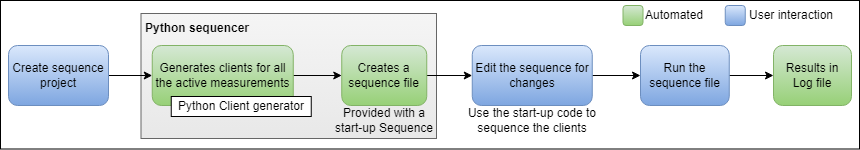

# An Example Measurement Plug-In Sequencer for Python

## Table of Contents

- [Overview](#overview)
- [Workflow Diagram](#workflow-diagram)
- [Dependencies](#dependencies)
- [Steps to use the Sequencer tool](#steps-to-use-the-sequencer-tool)
  - [Step 1: Install the Package](#step-1-install-the-package)
  - [Step 2: Run the Sequencer](#step-2-run-the-sequencer)
  - [Step 3: Review the Generated Sequence File](#step-3-review-the-generated-sequence-file)
  - [Step 4: Set Up Logging](#step-4-set-up-logging)
  - [Step 5: Execute the Sequence](#step-5-execute-the-sequence)
- [Notes](#note)

## Overview

This tool serves as a reference for integrating the Measurement Plug-In Client Generator to generate measurement plug-in clients and showcase the sequencing of measurement plug-ins using the generated clients.

## Workflow Diagram



## Dependencies

- Python 3.9 or later

## Steps to use the Sequencer tool

### Step 1: Install the Package

After downloading the `ni_measurement_plugin_sequencer-x.x.x-py3-none-any.whl` wheel file from the latest release assets, install the package using the command below.

```bash
pip install <path_to_ni_measurement_plugin_sequencer-x.x.x-py3-none-any.whl>
```

### Step 2: Run the Sequencer

To run the `ni-measurement-plugin-sequencer`, open your command line and enter:

```bash
ni-measurement-plugin-sequencer <path_to_sequence_directory>
```

- **<path_to_sequence_directory>**: Specify the directory path where the generated clients and sequence files will be stored. Confirm that the directory exists and has the necessary write permissions.

### Step 3: Review the Generated Sequence File

The generated `sequence.py` file will contain the following:

- `pin_map_methods`: A list of methods used to register the pin map for the measurement plug-ins. Update `pin_map_path` variable with the pin map file path.
  - These lines of code can be removed for the non-pin-centric workflow.
- A loop that registers the pin map for each Measurement Plug-in.

**Note:** Users must update the `sequence.py` file to define their sequences using the generated measurement plug-in clients.

### Step 4: Set Up Logging

- A basic logger package (`ni_sequence_logger`) is provided to log the execution results of the sequence.
- Download this logging package from the latest release assets and install using the command,

 ```bash
 pip install <path_to_ni_sequence_logger-x.x.x-py3-none-any.whl>
 ```

- Once installed, the logging package will initialize the logging configuration for the script, helping capture logs from various operations throughout the sequence.

### Step 5: Execute the Sequence

- Run the `sequence.py` file to execute the sequence.
- The log will be saved as a CSV file in the current working directory.

```text
Note: Before creating clients, the tool automatically handles directory cleanup by,

- Clearing the content of the `__init__.py` file (if it exists).
- Removing all generated clients.
- Deleting the `sequence.py` file (if present).
```

### Note

- No dependency management: The user must take care of managing the dependencies for the respective sequence directory.
  - The sequencer doesn't generate a `pyproject.toml` file. Instead, the user must ensure that the necessary dependencies are installed.

## Note

- For additional information on implementation details or guidance on integrating the Measurement Plug-In into your custom application, please refer to the documentation here: [Measurement Plug-In Client Integration](/docs/Measurement%20Plug-In%20Client%20Integration.md)
