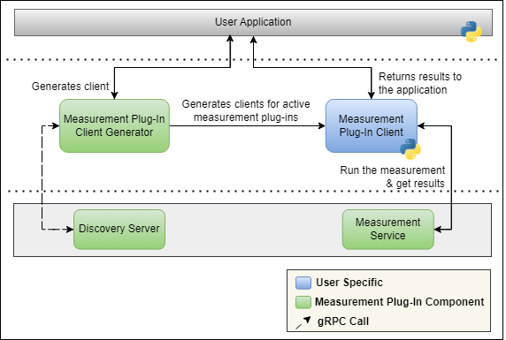

## Table of Contents

- [Integrating Measurement Plug-Ins with User Applications](#integrating-measurement-plug-ins-with-user-applications)
- [Scenario: Sequencing Measurement Plug-Ins](#scenario-sequencing-measurement-plug-ins)
- [Solution: Measurement Plug-In Clients](#solution-measurement-plug-in-clients)
- [How to Integrate the Measurement Plug-In Client Generator?](#how-to-integrate-the-measurement-plug-in-client-generator)
- [Example of Integrating the Measurement Plug-In Client Generator into a User Application](#example-of-integrating-the-measurement-plug-in-client-generator-into-a-user-application)

# Integrating Measurement Plug-Ins with User applications

Users can call and execute measurement plug-ins from their applications. This document considers a **sequencer** as the user application.

## Scenario: Sequencing Measurement Plug-Ins

Consider a user application designed to sequence and execute measurement tasks. How can support for Measurement Plug-ins be effectively incorporated into this application?

## Solution: Measurement Plug-In Clients

Measurement Plug-In clients allow users to easily call and execute measurements directly from a Python script, streamlining the process of invoking measurements within the user application.

Note: Refer to this [document](https://www.ni.com/docs/en-US/bundle/measurementplugins/page/meas-plugin-client-python.html) for more information on the Measurement Plug-In Client with Python.

The following visual illustrates how the Measurement Plug-In Client Generator can be used to create clients that invoke measurement plug-ins within the user application.



## How to Integrate the Measurement Plug-In Client Generator?

- Install the Measurement Plug-In Client Generator package:

  ```bash
  pip install ni-measurement-plugin-sdk-generator
  ```

- Usage 1:

    ```python
    import ni_measurement_plugin_sdk_generator.client
    
    args = [f"-s{measurement_service_class}", f"-o{output_directory}", f"-c{class_name}", f"-m{module_name}"]
    try:
        ni_measurement_plugin_sdk_generator.client.create_client(args=args)
    except Exception as e:
        raise Exception("Exception was thrown during client generation: ", e)
    ```

    The try-except code block can be surrounded with a loop for creating clients for multiple measurement plug-ins as shown below.

    ```python
    import ni_measurement_plugin_sdk_generator.client

    for measurement in available_measurement_services:
          # You can define your own functions to structure the class name and module name and validate the arguments accordingly
          args = [f"-s{measurement.service_class}", f"-o{client_module_directory}", f"-c{class_name}", f"-m{module_name}"]
          try:
              ni_measurement_plugin_sdk_generator.client.create_client(args=args)
          except SystemExit as e:
              if e.code != 0:
                  continue
          except Exception as e:
              raise Exception("Exception thrown from client generation: ", e)    
    ```

- Usage 2:
  
  To create clients for multiple measurement plug-ins, you can provide multiple service classes as shown below.
  
  ```python
  import ni_measurement_plugin_sdk_generator.client
  
  args = [f"-s{measurement_service_class_1}", f"-s{measurement_service_class_2}", f"-s{measurement_service_class_3}", f"-o{client_module_directory}"]
  try:
      ni_measurement_plugin_sdk_generator.client.create_client(args=args)
  except Exception as e:
      raise Exception("Exception thrown from client generation: ", e)
  ```

## Example of Integrating the Measurement Plug-In Client Generator into a User Application

For a practical implementation of this workflow, please refer to our example [sequencer](../README.md).
